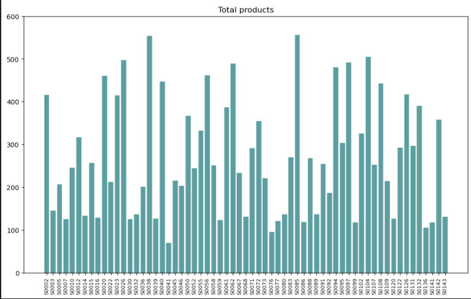

# Time series prediction

Description: 
- Revenue forecast using: simple average, arima, arimax and sarimax models
- PCA in order to reduce the number of store IDS
- Hierarchical clustering using the selected PC

### Part I: Revenue forecast for the 5 upcoming weeks 

**Datasets**

All the datasets used can be found below:

-
-
-

The CRISP DM methodology has been used throughout the report:

- Business/Data Understanding
- Data Preparation
- Modeling
- Evaluation
- Forecast

Each step is briefly described as follows:

**1) Business/Data understanding**

As mentioned above, there are 3 datasets with a csv extension:

- Sales (14 columns in total):
  1. Unnamed column (PK);
  2. Store ID: ID of each store (FK);
  3. Product ID: ID of each product (FK);
  4. Date: date of each sale (yyyy-mm-dd format)
  5. Sales: number of sales
  6. Revenue: revenue of each sale
  7. Stock
  8. Price
  9. Promo columns: promo_type_1, promo_bin_1, promo_type_2, promo_bin_2, promo_discount_2, promo_discount_type_2

- Cities (6 columns in total):
  1. Store ID (PK);
  2. Store type ID
  3. Store size
  4. City old ID
  5. Country ID
  6. City code 

- Product (10 columns in total):
  1. Product ID (PK);
  2. Product length;
  3. Product depth;
  4. Prodcut width;
  5. Cluster ID
  6. Hierarchy: hierarchy1_id, hierarchy2_id, hierarchy3_id, hierarchy4_id and hierarchy5_id

After analysing all datasets, it can be deducted:
- There are **63** different stores located in Turkey;
  
  
- The sales dataset includes **daily** sales/revenue per store from January 2017 to September 2019;
- Total products and total revenue vary between stores:
  
  
  

**2) Data Preparation**

  
  
  
  
